# **Library Management System**

It seems fair to say that most of libraries are facing impact of
advancing technology and computerization of human and paper powered
systems is a necessity.

The aim of this work is to develop library management system using
Visual Basic .NET programming language. System should:

  - provide an option to lease or return a book depending upon
    availability

  - keep the record of leased books,

  - provide option to list the collection filtered by lease state.

## INITIALISATION

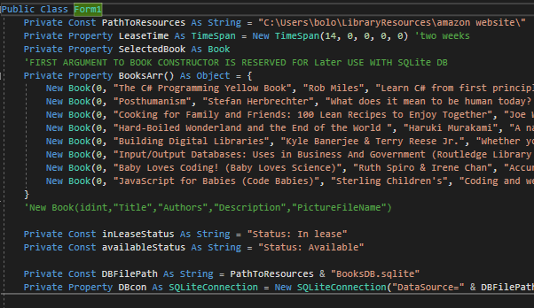

Figure 1a. Preparation of properties.

During Initialisation helper properties are declared, letting to
abstract from hard-coded values in main logic code. Properties include:

  - path pointing to location where pictures and SQLite Database are
    stored,

  - default lease time for book,

  - initial example Array of **Book** instances.

1.Book Class declaration. (Figure 1b)

All properties of a book are provided as constructor arguments, except
**isLeased** **Boolean**, describing the lease state of the particular
book, defaulting to false, and being changed only during Database
reading operations or leasing/returning the book. IComparable interface
has been implemented to allow sort books alphabetically.
**LeaseBook(DateOfReturn)** and **ReturnBook()** methods provide safe
interface for changing the value of its lease state.

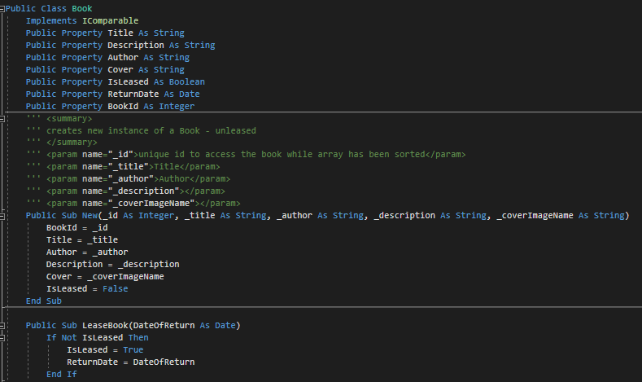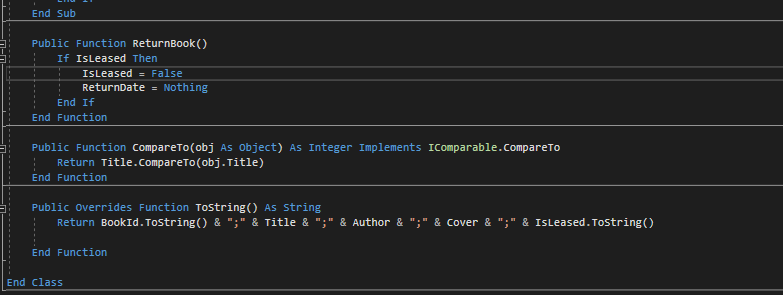

Figure 1b. Book Class declaration.

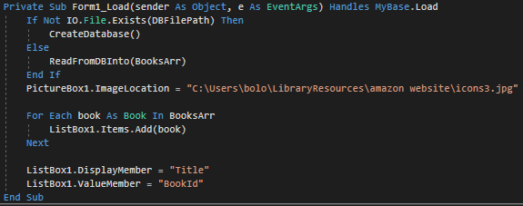

Figure 2. Load event – recovering stored data and populating ListBox .

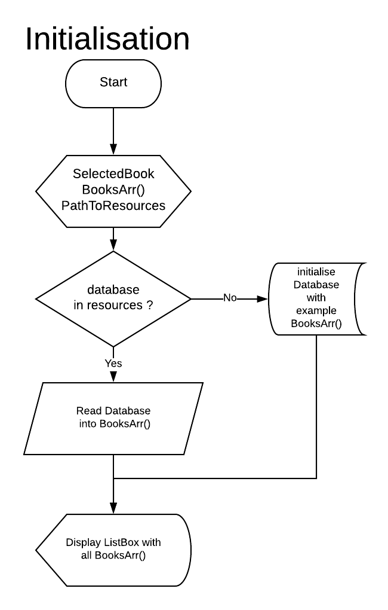

Initialisation (Figures 2 & 2b) checks for existing database or creates
one from example data hard-coded in **BookArr()** declaration.

Functions **CreateDatabase()** and **ReadFromDBinto(array)** contain
abstracted details of connecting with SQLite Database, which are beyond
the requirements of this assignment, and were exercised only to develop
better understanding of professional approach to library system
management, and will be briefly addressed at the end. Default picture is
being displayed, and Listbox filled with contents of BookArr() in
foreach loop.ListBox1.DisplayMember is set to display titles of books.

Next, depending which action user has taken, following procedures are
being executed:

## BOOK SELECTION

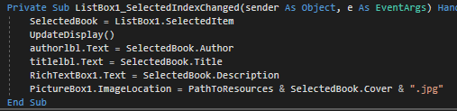

Figure 3.SelectedIndexChanged event handler.

Books can be selected in two ways, by clicking the desired title on the
**ListBox** or pressing the *next/previous (“\<\<”,”\>\>”)* buttons. The
latter performs operation on **ListBox.SelectedIndex** property which in
turn results in an **SelectedIndexChanged** event invoking the selection
procedure described in section 1. This approach allowes to reduce amount
of cryptic code ,repetitive **if**-statements and organise code in
atomized and transparent manner. Any other procedures use
**SelectedBook** property referring to currently selected **Book**
object stored in the **BooksArr** array.

1.Direct Book Selection

Direct book selection occurs when user clicks on the title displayed in
the ListBox resulting in **SelectedIndexChanged** event, handled by
function that stores the reference to the object in the **SelectedBook**
property (Figure 3). Appropriate textboxes are filled with corresponding
values of a selected book. **PictureBox1.ImageLocation** is set to
string path to picture expressed as concatenation of base path, cover
file name reference, and extension.

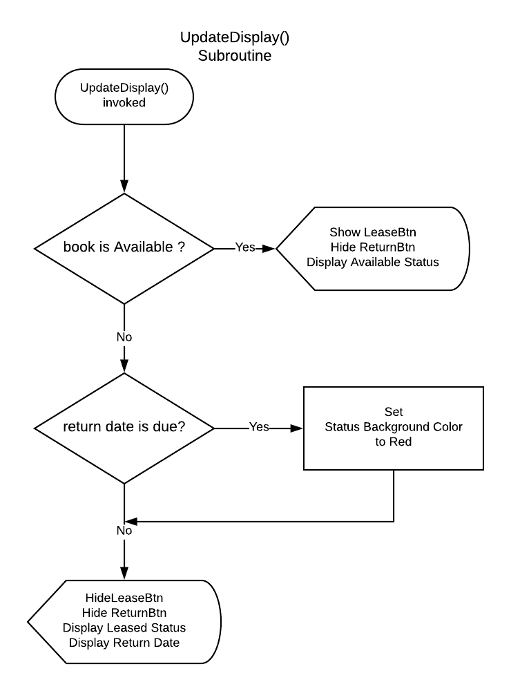

Figure 4a. UpdateDisplay Subroutine - flowchart.

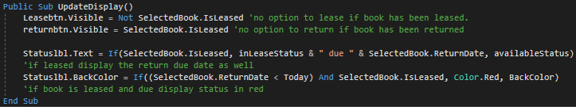

**UpdateDisplay** subroutine (Figures 4a & 4b.) factors out the code
responsible for updating only the controls that change depending on book
lease state. *Lease* button is displayed only when book is available to
lease and vice versa, by simply assigning logical **NOT** of book’s
**Boolean** lease state to visibility of *Lease* Button. Equally, the
return button visibility is directly dependent on the same value. This
way allows to achieve instant user feedback, expanded on in second part
of assignment. The ternary expression has been used, assigning the value
in declarative-like manner on the basis of Boolean value of condition -
arithmetic comparison between the Date type and **Today** variable.
**Today** is the automatic variable returning the current system time in
the format of **Date** Type, used here to decide if the book has been
kept above the permissible limit. Figures 4 and 5 present the GUI in
these cases. The return date is displayed, along the status, and if
return date is due, status is highlighted red.(Figure 6).

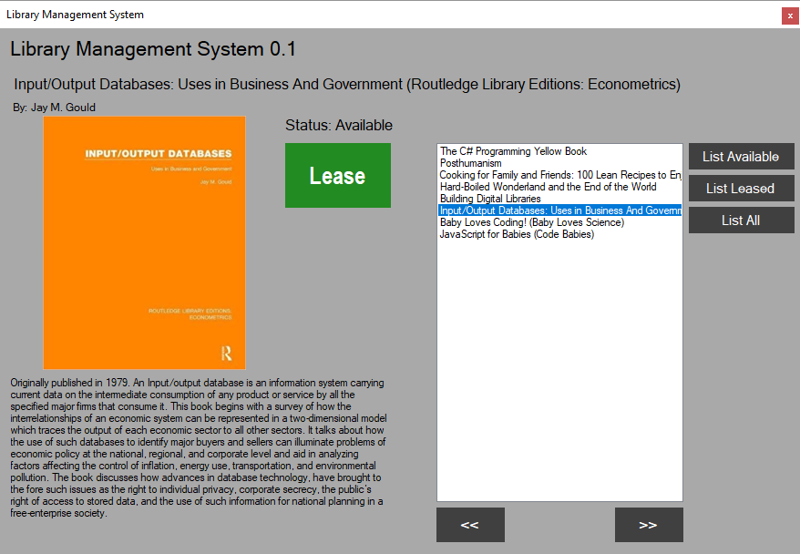

Figure 5.Example of interface. Book is Available To
Lease.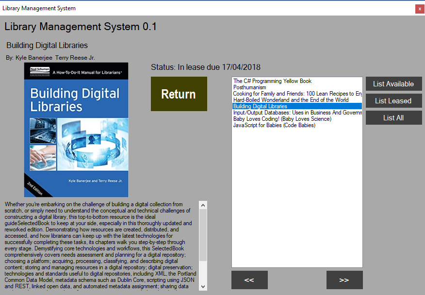

Figure 6. Example of interface- Book is Leased.

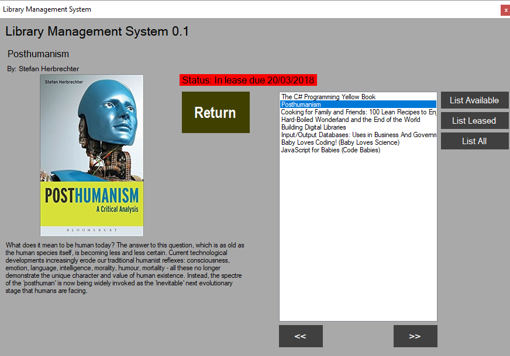

Figure 7. Example of interface - Book is due.

2.Selection by Next/Previous buttons.

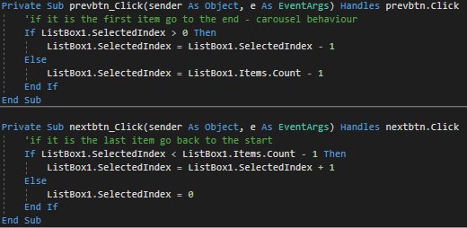

Figure 8a. Next/Previous Book button handlers.

Buttons simply change the **SelectedIndex** property of **ListBox** and
provide cyclical behaviour of list. Clicking the Next button while on
last book, user selects the first book in the list. Comparing the
current index with zero, and index of last element we can determine
moment when user reaches the start/end of the list. Flowchart on figure
8b describes simple logic of source code from Figure 8a.

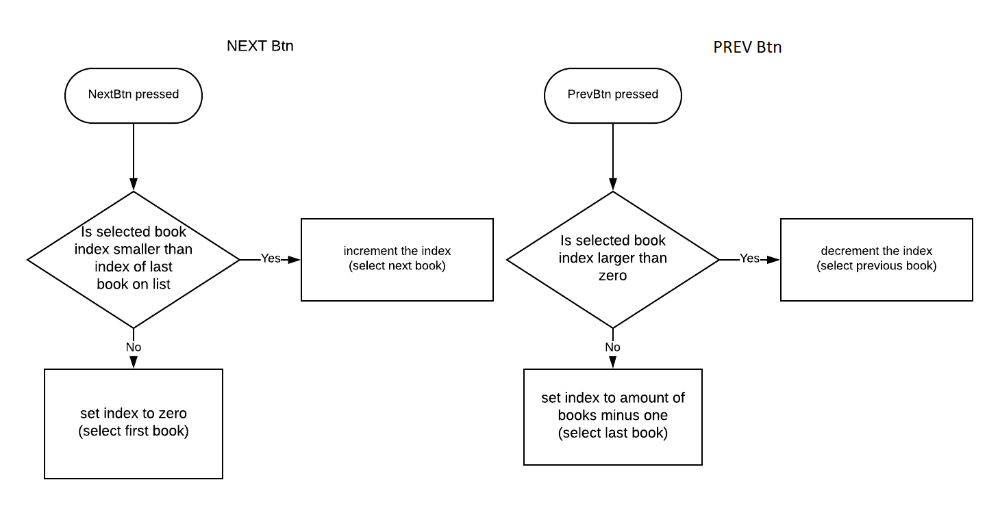

Figure 8b. Next/Previous Book button handlers

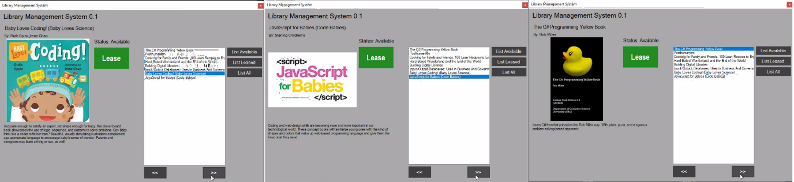

Figure 9a. Result of consecutive clicks on next book button.

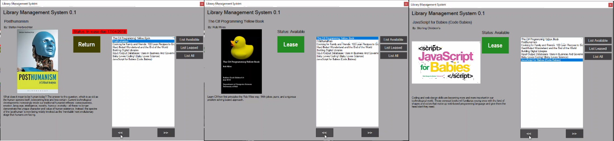

Figure 9b. Result of consecutive clicks on previous book button.

Figures 9a and 9b present the user interface while performing selection
with this method. Notice the behaviour of **PictureBox** with
**SizeMode** set to **Zoom**, where book covers maintain original aspect
while user interface layout remains unchanged.

## LEASING/RETURNING BOOK

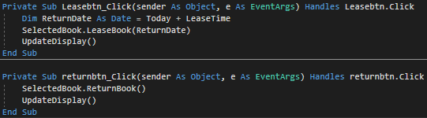

Figure 9. Lease/Return Buttons handlers

Complete Logic for ensuring the validity of book’s lease state is hidden
away in **LeaseBook** method of **Book** object, declaration of which is
displayed on figure 1b, and simply prevents book from being
leased/returned twice in a row; However, since interface itself does not
allow for this to happen its function will be useful only in case of
**Book** class being reused in different projects. The flowchart for
controlling visibility/accessibility of these options is already covered
on Figure 4a.

The **Book** object stores the return due date in its
**Book.ReturnDate** field to be accessible for database write/read
functions, and for **UpdateDisplay** subroutine, where it is being
accessed and displayed to the user. Display is updated to provide
graphical response on user action. The *Lease* button disappears and the
return button is displayed along with the return date.

## FILTERED LISTING

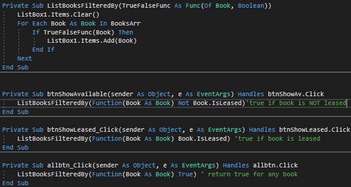

Figure 10. Listing subroutine and click event handlers.

*List All*, *List Available* and *List Leased* Buttons allow user to
filter displayed books list by their lease state. It is achieved by
looping through array of books and adding the object reference to list
if condition provided is true. Looping logic is extracted into a
subroutine, accepting delegate function as a parameter. The delegate
function is declared to behave as a filter, accepting **Book** object
and returning a **Boolean** that indicates whether the book object
should be displayed in the **ListBox**. This approach opens future
possibilities for querying the book collection against different
conditions - specifying author, title or any other condition while
abstracting from looping mechanism. Following figures present the
graphical interface while choosing above options.

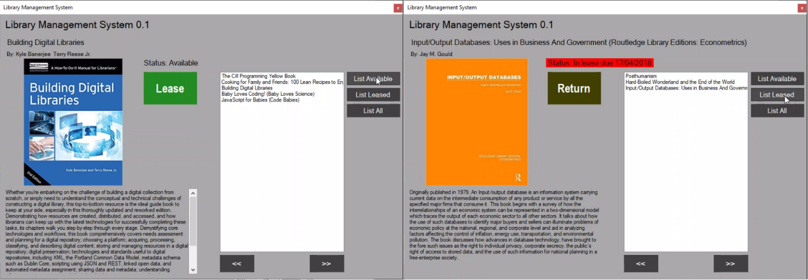

Figure 11. GUI - listing available books (left), and leased books
(right).

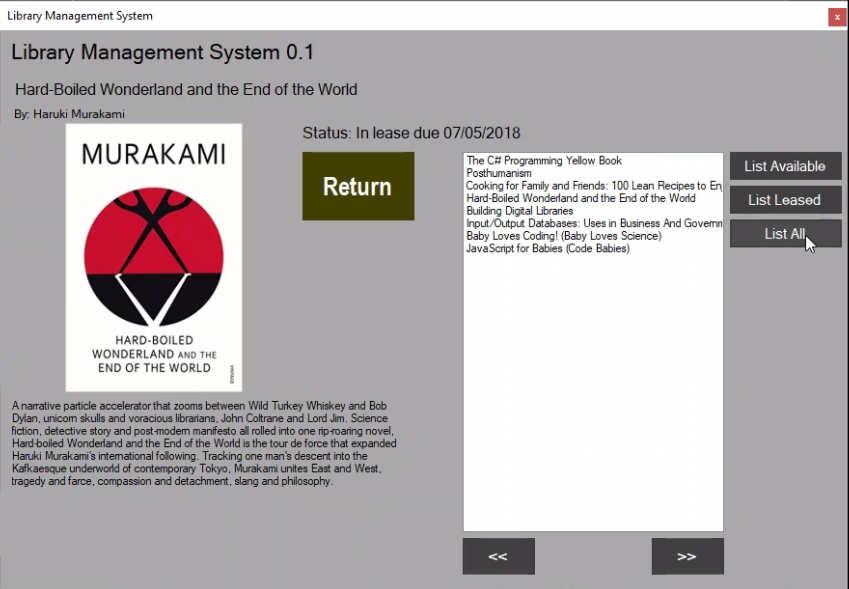

Figure 12.GUI - result of pressing List All button.

## RESOURCES FOLDER AND SQLITE DATABASE

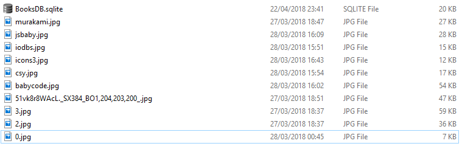

Figure 13. Files in PathToResources Folder.

Functions **CreateDatabase()** and **ReadFromDBinto(array),** mentioned
in the Initialisation section of this work , and **SaveLeaseState()**
function operate on SQLite database and provide convenient way to store
and retrieve the data of book collection. As this functionality is not a
requirement of an assignment they were separated and moved into
functions; However, accessing SQL results requires accessing the results
array by numerical indexes through diverse SQLiteResult.GetValue
methods. The source-code for mentioned functions follows:

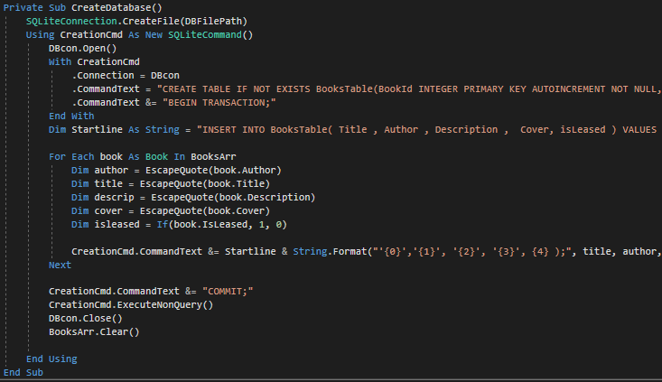

Figure 14. Creating Database file and a table from data in BookArr()

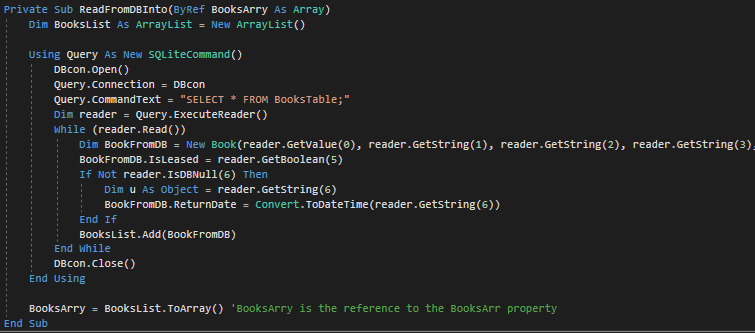

Figure 15. Reading data from database into Array

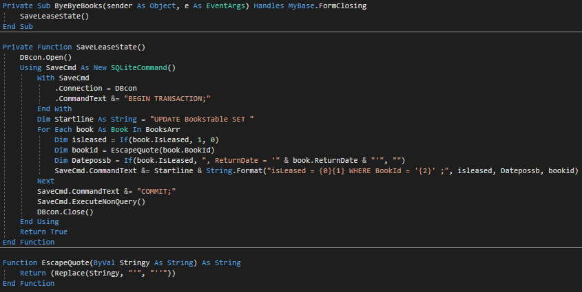

Figure 16.FormClosing event handler, function saving data to SQLite
file, and function escaping SQLite single quotes.

## ** Self-reflective commentary.**

The main struggle while programming an application regards the conflict
between will to explore the possibilities of the language, expanding my
knowledge about programming paradigms, and keeping the source code
simple and proving the required knowledge. Even though having advantage
of basic knowledge about classes, functional orientation and
encapsulation, i attempted to store each property of a book in separate
arrays to follow usage of arrays indicated in requirements. Data was
contained in Arrays of Strings for Title, Description, Author, and
picture Image Name, and array of Booleans for lease statuses. It proved
soon to be tedious and prone to errors as indexes of separate arrays
were not matching while operating on **ListBox** displayed values. Due
to that displaying list of books filtered by lease status became very
complex task, requiring checking the index of a title in array, then
using it to retrieve remaining properties. Accessing data this way was
cryptic, and affected code readability. Especially the state of lease
status of the book was hard to maintain across separate arrays. Since my
main goal was to abstract from hard-coded values and multiple if
statements, I decided to research on creating data structures in VB or
classes that would allow me to write less verbose, more elegant and
clearer code, creating fields with separate Data Types (String, Int32,
Boolean, Date), distinctive names, and addressing them in more human
readable way. The usage of Array datatype was then reduced to role of
containing references to Book objects, and significantly simplified the
logic of filtering list of books. It let me refactor code around
references to these objects, and addressing the selected index property
only in ListBox1.selectedindexchanged event handler. Altogether, it made
code requiring less additional comments, and easier to read. Conversely,
it moved me away from practising low-level technical aspects of
accessing arrays using indexes.

Researching on features of **ListBox** I discovered that
**ListBox.items** member can be collection of any objects, and
**ListBox** control offers possibility to represent object references
stored in its collection through its **Listbox.DisplayMember** property
(MSDN, 2018a). Discovering these facts let me to focus on creating my
own data structure - Book that would be represented by its Title field
using **DisplayMember** functionality, thus organising my code in more
comprehensible way, around collection of Book objects, what opened
future possibilities to develop the project into much more flexible
system and made operations on behaviour of controls easier to implement.
Following Assignment requirement I made options to Lease book/Return
book unavailable accordingly setting the **button.Visible** property.
This reduces the time that user spends on achieving the information
about the lease state of the book, and constrains the decisions to only
valid options. (Amant, 2000). In Other words, user do not need to click
on the *Lease* button in order to learn that it is already leased, and
vice Versa, if this is the case. This simplifies both the controls
layout and flow control. The downside of the approach may become
apparent in case when lease state would not be of Boolean nature, for
instance when the book is in the stock, but cannot be leased for some
specific reason, or case when we would like to store amount of times
when the book lease has been extended.

User interface implementation required research around **PictureBox**
form control, and many other style properties of controls explained in
Microsoft Developers Network(2018b) documentation. Coming from web
development background I put more attention to graphical user interface,
and decided to make it appealing, simple and modern. For instance, using
Zoom value on **PictureBox.SizeMode** allowed me to retain shape of the
control, regardless of displayed picture size. For testing purposes, I
used various book cover shapes of non-standard aspect ratio. Coding
carousel behaviour on items list, when *“next book”* or *“previous
book”* buttons are clicked, helps users to maintain uninterrupted
experience.

Approaching to the final form of the application I had to constantly
constrain myself, to not start implementing new features, and focus on
main requirements of the assignment. Brown et al. (1998) and Prabhakar
(2008) identified this problem, commonly referred as “Feature Creep” in
software development literature. As my knowledge about programming
exceeds requirements of current year, the passion to learn about
programming stays in conflict with keeping the implementation easy to
explain and keeping the extra features not shadowing the substantial
requirements which marking criteria are based on. One of results of
mentioned issue was implementing the SQL database connection to store
book collection and its state between sessions. While helping me with
understanding some of the core concepts, and use index based array
access, It required me to decouple it and factor out of main logic in
the final version making me spend time on implementation details of
feature that is not attributing to the goal.

I am overall satisfied from progress I made during this assignment. The
conflict between exploration of language features and maintaining the
code complexity led to positive outcome, enforcing me to learn how to
abstract from implementation details. Additionally, having encountered
numerous methods and language features, for instance **IComparable**
implementation on book objects, “**with**” and “**using**” expressions
or delegate lambda functions, kept me enjoyed and motivated during
programming. Still, there are certain aspects that could be implemented
in a more professional manner, leaving room for further improvement of
my programming skills. I didn’t succeed in achieving the effect of books
disappearing from the list when clicked, as I was trying to avoid
repeating refreshing the view and looping through array each time. I
struggled with this concept until colleague explained to me his use of
two **ListBoxes**. Such approach or making use of **ListBox.DataSource**
property (MSDN, 2018c) could save a lot of unnecessary memory
operations. It proves that my problem-solving skills and documentation
research could improve, and often simplest and most elegant solution
requires thinking out of the (List)Box.

REFERENCES:

  - Amant, St. R. (2000) *Real-World Examples for HCI Instruction.*
    Available At:
    <https://pdfs.semanticscholar.org/b6a6/de7ed2f61753a80add12354d56aaa967bdb4.pdf>
    (Accessed:3/4/18)

  - Brown, W. J. , Malveau R. C., McCormick III, H. W., Mowbray , T.J.
    (1998) *AntiPatterns: Refactoring Software, Architectures, and
    Projects in Crisis.* New York: John Wiley & Sons, Inc.

  - MSDN Microsoft Developer Network(2018a) *ListControl.DisplayMember
    Property.* Available At:
    <https://msdn.microsoft.com/en-us/library/system.windows.forms.listcontrol.displaymember(v=vs.110).aspx>
    (Accessed:3/4/18)

  - MSDN Microsoft Developer Network(2018b) *System.Windows.Forms
    Namespace.* Available At:
    <https://msdn.microsoft.com/en-us/library/system.windows.forms(v=vs.110).aspx>
    (Accessed:3/4/18)

  - MSDN Microsoft Developer Network(2018c) *ListControl.DataSource
    Property* Available At:
    https://msdn.microsoft.com/en-us/library/system.windows.forms.listcontrol.datasource(v=vs.110).aspx
    (Accessed:3/4/18)

  - Prabhakar, G. P. (2008) Scope creep in software development*.
    Journal of Social Management* 6(1) pp.45-59. Available At:
    https://www.researchgate.net/publication/281743773 (Accessed:
    3/4/18)
